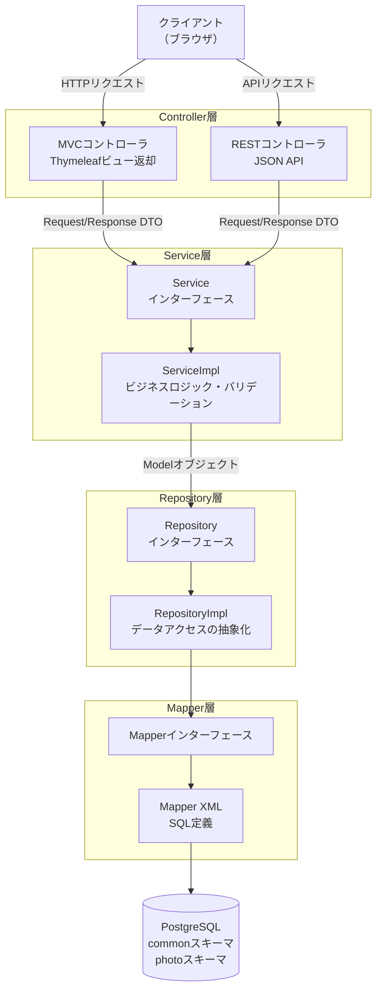
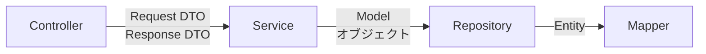

# レイヤード・アーキテクチャ

## 全体構成図



## 各レイヤーの役割

| レイヤー | 役割 | 主なパッケージ |
|----------|------|----------------|
| Controller | MVCコントローラ（Thymeleafビュー）/ RESTコントローラ（JSON API） | `controller/` |
| Service | ビジネスロジック・バリデーション | `service/`, `service/impl/` |
| Repository | データアクセスの抽象化 | `repository/`, `repository/impl/` |
| Mapper | MyBatisによるSQL実行 | `mapper/`, `resources/com/web/gallary/mapper/` |

## 設計方針

### インターフェースと実装の分離

Service・Repositoryはインターフェースと実装クラスに分離しています。

```
service/
├── PhotoService.java          # インターフェース
└── impl/
    └── PhotoServiceImpl.java  # 実装クラス（@Service）

repository/
├── PhotoRepository.java          # インターフェース
└── impl/
    └── PhotoRepositoryImpl.java  # 実装クラス（@Repository）
```

### レイヤー間のデータ受け渡し

各レイヤー間では専用のオブジェクトを使用してデータを受け渡します。



| 区間 | 使用するオブジェクト | パッケージ |
|------|----------------------|------------|
| Controller ↔ Service | Request/Response DTO | `controller/request/`, `controller/response/` |
| Service ↔ Repository | Model オブジェクト | `model/` |
| Repository ↔ Mapper | Entity | `entity/` |

### オブジェクト変換

レイヤー間のオブジェクト変換には **ModelMapper** を使用しています。

### コード生成

すべてのEntity・Model・DTOクラスでは **Lombok** アノテーション（`@Getter`, `@Setter`, `@Builder` 等）を使用してボイラープレートコードを削減しています。
