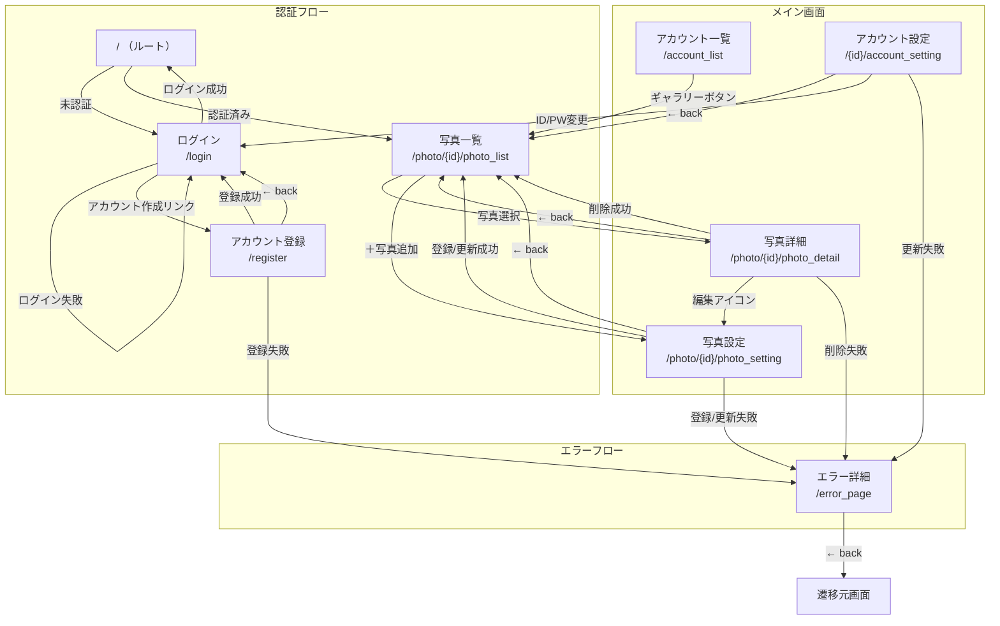
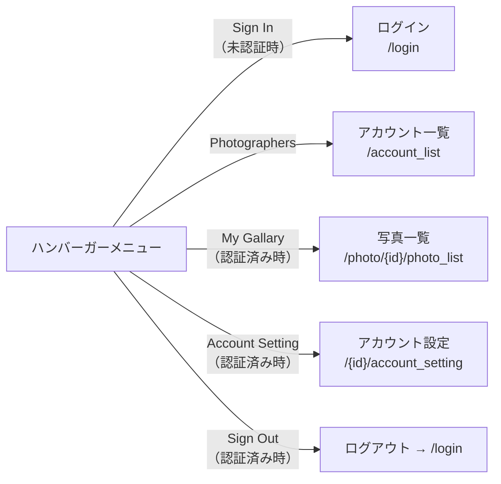
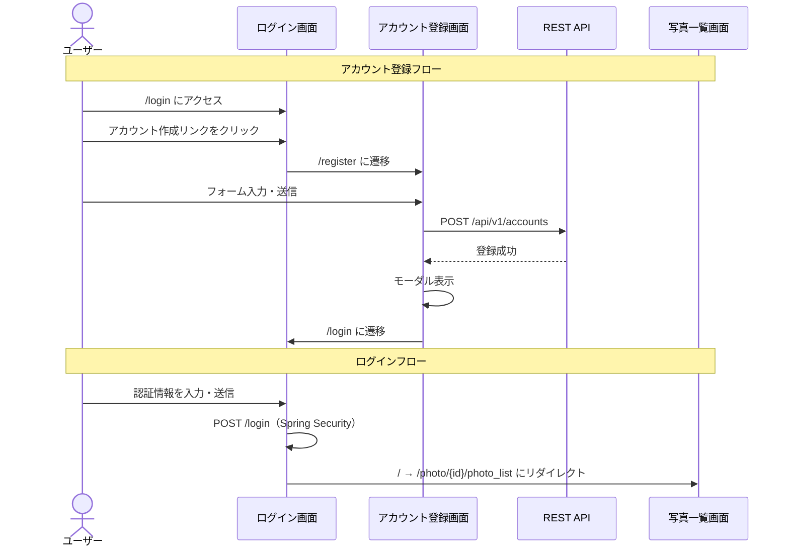
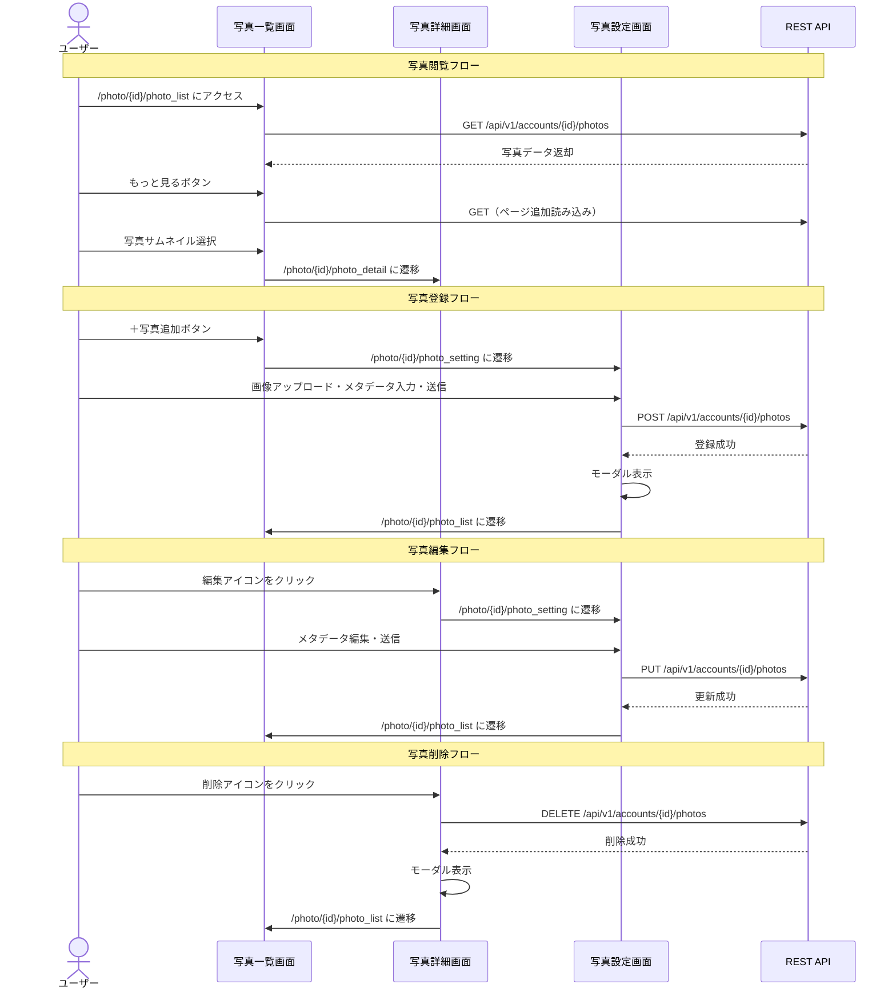
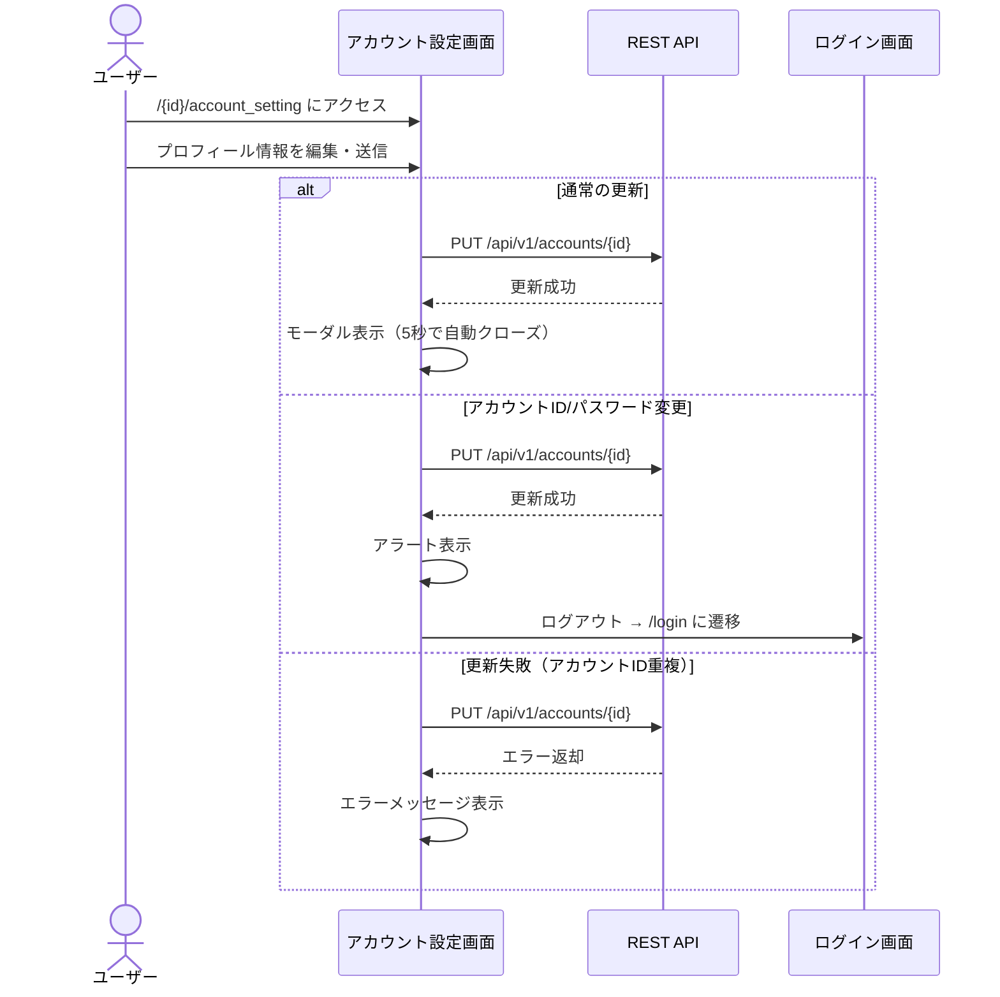
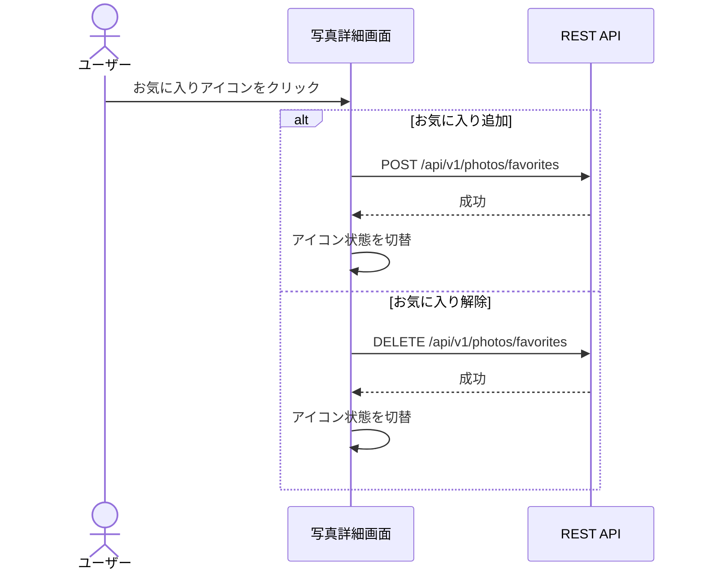

# 📺 画面遷移図

## 画面一覧

| # | 画面名 | ビュー名 | URLパス | アクセス制御 |
|---|--------|----------|---------|-------------|
| 1 | ログイン | `login` | `/login` | 公開 |
| 2 | アカウント登録 | `account_register` | `/register` | 公開 |
| 3 | アカウント一覧 | `account_list` | `/account_list` | 公開 |
| 4 | アカウント設定 | `account_setting` | `/{accountId}/account_setting` | 認証必須（本人のみ） |
| 5 | 写真一覧 | `photo_list` | `/photo/{photoAccountId}/photo_list` | 公開 |
| 6 | 写真詳細 | `photo_detail` | `/photo/{photoAccountId}/photo_detail` | 公開 |
| 7 | 写真設定 | `photo_setting` | `/photo/{photoAccountId}/photo_setting` | 認証必須（本人のみ） |
| 8 | エラー | `error` | `/error` | 公開 |
| 9 | エラー詳細 | `error_page` | `/error_page` | 公開 |

---

## 全体遷移図

---

## 共通メニュー遷移

全画面のハンバーガーメニューから以下の遷移が可能です。

---

## 認証フロー詳細

---

## 写真管理フロー詳細

---

## アカウント設定フロー詳細

---

## お気に入りフロー

---

## 遷移詳細テーブル

### ルート (`/`)

| 条件 | 遷移先 |
|------|--------|
| 未認証 | `/login` にリダイレクト |
| 認証済み | `/photo/{accountId}/photo_list` にリダイレクト |

### ログイン (`/login`)

| 操作 | 遷移先 | 方式 |
|------|--------|------|
| ログイン成功 | `/` → `/photo/{accountId}/photo_list` | POST（Spring Security） |
| ログイン失敗 | `/login`（エラー表示） | リダイレクト |
| 「アカウント作成」リンク | `/register` | リンク |

### アカウント登録 (`/register`)

| 操作 | 遷移先 | 方式 |
|------|--------|------|
| 登録成功 | `/login` | AJAX → モーダル → フォーム送信 |
| 登録失敗（重複） | `/register`（エラー表示） | 画面内表示 |
| 登録失敗（その他） | `/error_page` | フォーム送信 |
| 「← back」リンク | `/login` | リンク |

### アカウント一覧 (`/account_list`)

| 操作 | 遷移先 | 方式 |
|------|--------|------|
| 「ギャラリー」ボタン | `/photo/{accountId}/photo_list` | リンク |
| メニュー「Sign In」 | `/login` | リンク（未認証時） |
| メニュー「My Gallary」 | `/photo/{accountId}/photo_list` | リンク（認証済み時） |
| メニュー「Sign Out」 | `/login` | ログアウト |

### アカウント設定 (`/{accountId}/account_setting`)

| 操作 | 遷移先 | 方式 |
|------|--------|------|
| 更新成功 | 同画面（モーダル表示） | AJAX |
| アカウントID/パスワード変更 | `/login` | AJAX → アラート → ログアウト |
| 更新失敗（重複） | 同画面（エラー表示） | 画面内表示 |
| 更新失敗（その他） | `/error_page` | フォーム送信 |
| 「← back」リンク | `/photo/{accountId}/photo_list` | リンク |
| メニュー「Sign Out」 | `/login` | ログアウト |

### 写真一覧 (`/photo/{photoAccountId}/photo_list`)

| 操作 | 遷移先 | 方式 |
|------|--------|------|
| 写真サムネイル選択 | `/photo/{photoAccountId}/photo_detail` | リンク |
| 「＋写真追加」ボタン | `/photo/{photoAccountId}/photo_setting` | リンク（本人のみ） |
| 「もっと見る」ボタン | 同画面（追加読み込み） | AJAX |
| 絞り込みフィルター | 同画面（再読み込み） | AJAX |
| メニュー「Photographers」 | `/account_list` | リンク |
| メニュー「My Gallary」 | `/photo/{accountId}/photo_list` | リンク |
| メニュー「Account Setting」 | `/{accountId}/account_setting` | リンク |
| メニュー「Sign Out」 | `/login` | ログアウト |

### 写真詳細 (`/photo/{photoAccountId}/photo_detail`)

| 操作 | 遷移先 | 方式 |
|------|--------|------|
| 編集アイコン | `/photo/{photoAccountId}/photo_setting` | リンク（本人のみ） |
| 削除アイコン → 成功 | `/photo/{photoAccountId}/photo_list` | AJAX → モーダル → リダイレクト |
| 削除アイコン → 失敗 | `/error_page` | フォーム送信 |
| お気に入りアイコン | 同画面（状態切替） | AJAX（認証済み時のみ） |
| 「← back」リンク | `/photo/{photoAccountId}/photo_list` | リンク |
| メニュー「Photographers」 | `/account_list` | リンク |
| メニュー「My Gallary」 | `/photo/{accountId}/photo_list` | リンク |
| メニュー「Account Setting」 | `/{accountId}/account_setting` | リンク |
| メニュー「Sign Out」 | `/login` | ログアウト |

### 写真設定 (`/photo/{photoAccountId}/photo_setting`)

| 操作 | 遷移先 | 方式 |
|------|--------|------|
| 登録/更新成功 | `/photo/{photoAccountId}/photo_list` | AJAX → モーダル → フォーム送信 |
| 登録/更新失敗 | `/error_page` | フォーム送信 |
| 「← back」リンク | `/photo/{photoAccountId}/photo_list` | リンク |
| メニュー「Sign Out」 | `/login` | ログアウト |

---

## REST API（画面遷移に関連するもの）

画面からAJAXで呼び出されるAPIの一覧です。結果に応じて画面遷移が発生します。

| API | メソッド | 呼び出し元画面 | 成功時の遷移 |
|-----|---------|-------------|------------|
| `/api/v1/accounts` | POST | アカウント登録 | → ログイン |
| `/api/v1/accounts/{accountId}` | PUT | アカウント設定 | → 同画面 or ログイン |
| `/api/v1/accounts/{photoAccountId}/photos` | GET | 写真一覧 | なし（データ表示） |
| `/api/v1/accounts/{photoAccountId}/photos` | POST | 写真設定（新規） | → 写真一覧 |
| `/api/v1/accounts/{photoAccountId}/photos` | PUT | 写真設定（編集） | → 写真一覧 |
| `/api/v1/accounts/{photoAccountId}/photos` | DELETE | 写真詳細 | → 写真一覧 |
| `/api/v1/photos/favorites` | POST | 写真詳細 | なし（状態切替） |
| `/api/v1/photos/favorites` | DELETE | 写真詳細 | なし（状態切替） |
